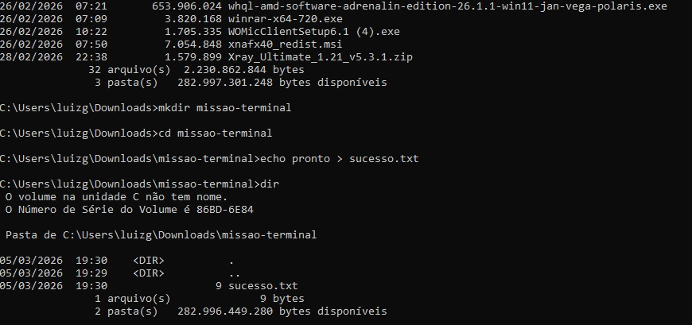

# ⚡ Meus Comandos Favoritos

Aqui estão os comandos que mais utilizei na aula de Terminal:

- cd: Para navegar entre pastas
- dir: Para listar arquivos
- mkdir: Para criar novas pastas
- echo: Para criar arquivos
- systeminfo: Para mostrar informações do sistema

## 📸 Evidência de Execução

